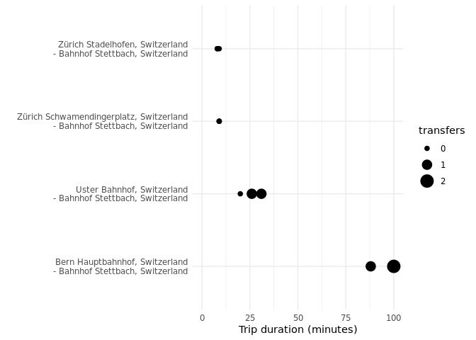

# openjourney


The openjourney package allows to query trip durations between
cooordinates within Switzerland. It wraps the [Open Journey Planer
API](https://opentransportdata.swiss/de/cookbook/open-journey-planner-ojp/)
provided by opentransportdata.swiss.

## Installation

You can install the the development version from
[GitHub](https://github.com/) with:

``` r
# install.packages("devtools")
devtools::install_github("tlorusso/openjourney")
```

``` r
library(openjourney)
library(tidyverse)
#> ── Attaching packages ─────────────────────────────────────── tidyverse 1.3.0 ──
#> ✓ ggplot2 3.3.2     ✓ purrr   0.3.4
#> ✓ tibble  3.1.0     ✓ dplyr   1.0.5
#> ✓ tidyr   1.1.3     ✓ stringr 1.4.0
#> ✓ readr   1.4.0     ✓ forcats 0.5.0
#> ── Conflicts ────────────────────────────────────────── tidyverse_conflicts() ──
#> x dplyr::filter() masks stats::filter()
#> x dplyr::lag()    masks stats::lag()
library(sf)
#> Linking to GEOS 3.8.0, GDAL 3.0.4, PROJ 7.0.0
library(tidygeocoder)
library(xml2)
```

# Usage

## API-Token

To be able to query the API a token is needed. A public key is available
in the
[documentation](https://opentransportdata.swiss/de/cookbook/open-journey-planner-ojp/#Einleitung)
which can be used for a limited number of queries. Private keys with
higher rate limits can be created on opentransportdata.swiss.

In our example we’ll use the public key:

``` r
token1 <- paste("Bearer", "57c5dbbbf1fe4d000100001842c323fa9ff44fbba0b9b925f0c052d1", sep = " ")
```

## Query trip durations

Lets get some coordinates for some sample locations.

``` r
# get coordinates of some locations
coords <- geo(address = c("Zürich Schwamendingerplatz, Switzerland",
                          "Zürich Stadelhofen, Switzerland",
                          "Uster Bahnhof, Switzerland",
                          "Bern Hauptbahnhof, Switzerland",
"Bahnhof Stettbach, Switzerland"),
method ='osm')
```

# Plot trip durations

``` r
ggplot(trips, aes(duration_min,
                  paste0(origin_id, "\n - ", destination_id),
                  size=transfers))+
  geom_point()+
  theme_minimal()+
  scale_fill_viridis_c()+
  labs(y="")+
  scale_x_continuous(limits=c(0,100))
#> Warning: Using size for a discrete variable is not advised.
#> Warning: Removed 3 rows containing missing values (geom_point).
```


